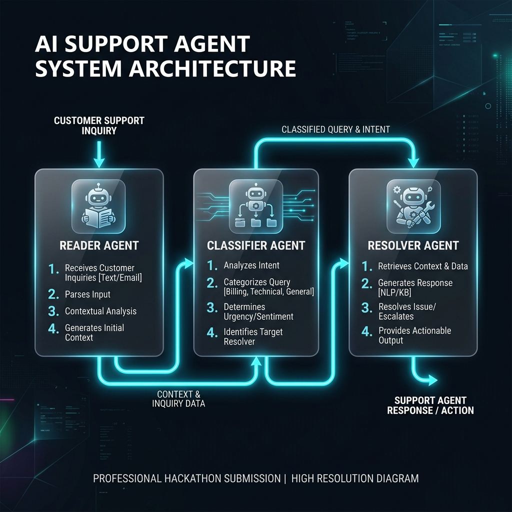

# ShopWave AI Support Agent 🤖

A high-performance, multi-agent autonomous system for e-commerce customer support. This system uses a tiered agentic loop to classify, research, and resolve customer tickets with human-level accuracy.

## 🚀 Overview
The system is built on an **Agentic Pipeline** architecture, where specialized LLM agents collaborate to solve complex support scenarios. It features deep tool integration, autonomous reasoning, and a real-time monitoring dashboard.

### 🛠️ Tech Stack
- **Core**: Python 3.10+
- **LLM Engine**: Groq (Llama-3.3-70b-versatile)
- **Framework**: Flask (Backend) + Vanilla Javascript/CSS (Frontend)
- **Streaming**: Server-Sent Events (SSE) for real-time audit trails
- **Concurrency**: Python ThreadPoolExecutor for batch processing

## 🏗️ Architecture
The system utilizes three primary autonomous agents:
1. **Reader Agent**: Extracts core entities (Order IDs, Emails) and sentiment signals.
2. **Classifier Agent**: Categorizes the ticket and determines if it can be resolved autonomously.
3. **Resolver Agent**: Executes a "Reasoning Loop" using 8+ custom tools to fulfill the customer's request.



## 📋 Setup & Installation

1. **Clone & Install Dependencies**:
   ```bash
   pip install -r requirements.txt
   ```

2. **Configure Environment**:
   Create a `.env` file in the root directory:
   ```env
   GROQ_API_KEY=your_key_here
   GEMINI_API_KEY=your_key_here
   ```

3. **Run the Application**:
   ```bash
   python server.py
   ```
   Open `http://127.0.0.1:5000` to access the dashboard.

## 📜 Audit Logs
Every demo run generates a comprehensive `audit_log.json` file in the project directory. This file contains the full reasoning trace, tool calls, and final decisions for every ticket, providing 100% transparency into the AI's logic.